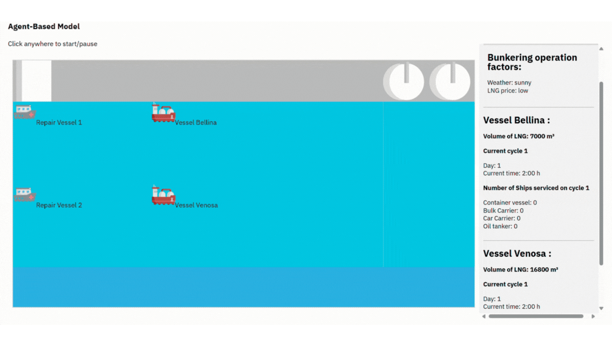
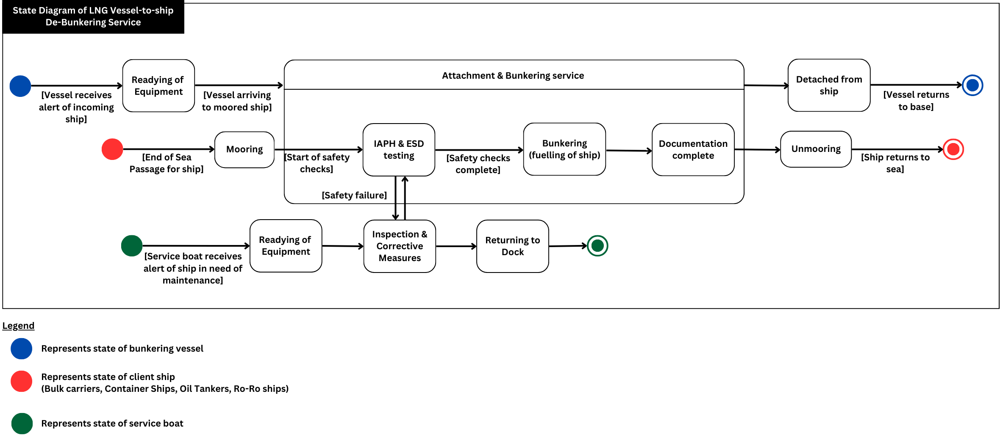
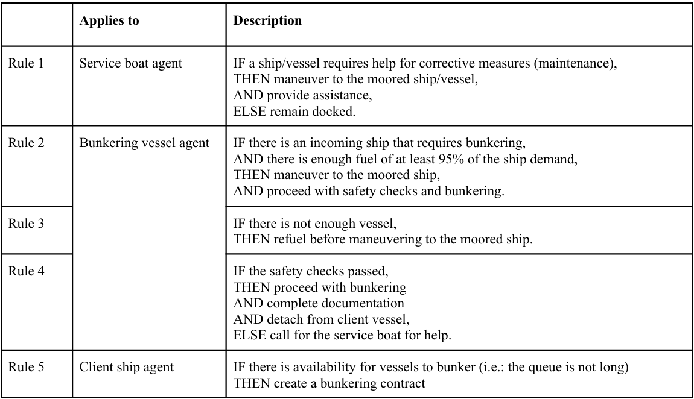
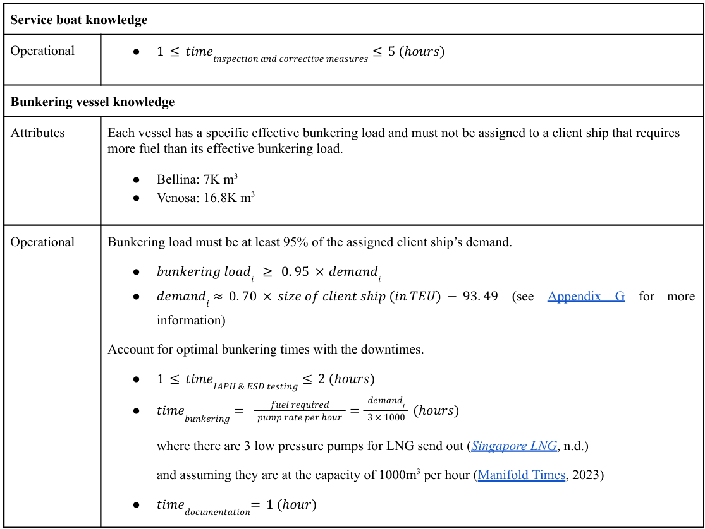
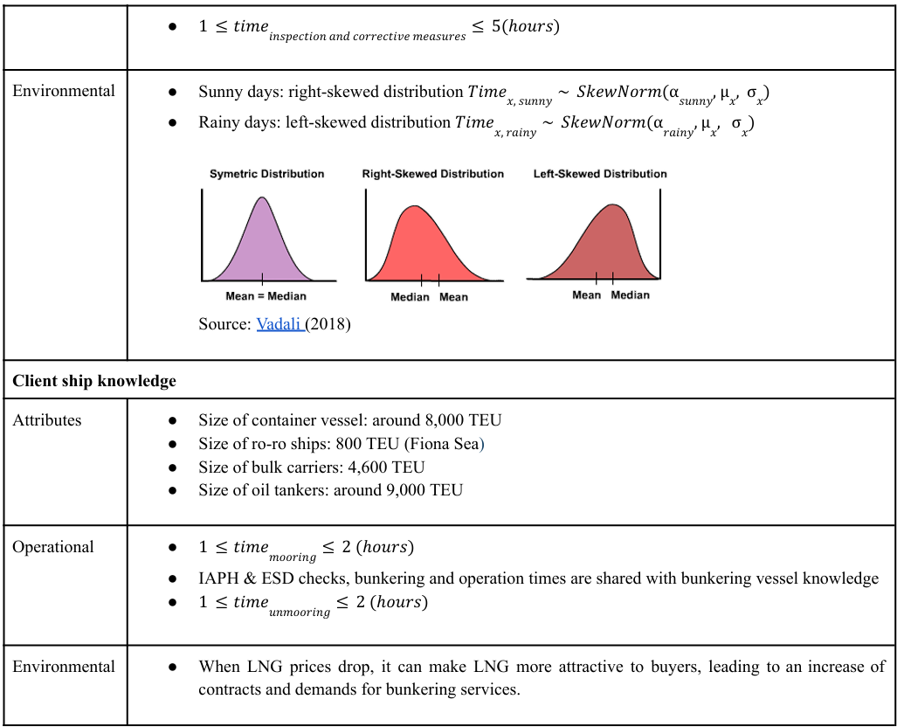

# ABS-simulation

## To-do's
☑️ Create side bar layout for statistics purposes.  
☑️ "Current cycle" statistics: 1h = 1s in simulation time.  
☑️ Fix vessels, ships & repair behaviours.  
☑️ Add weather and LNG prices as environmental factors.   
⬜Fix vessels/ships behaviours: have a waiting queue/list in line.  
⬜Deploy to cloud (if needed).

## About
Agent-based Simulation (ABS) for debunking services based on the following states and agent rules.

<div style="text-align: center;">
    
    <p>Fig. 1: Final ABS user interface (UI).</p>
</div>

<div style="text-align: center;">
    
    <p>Fig. 2: State diagram for the three agents used.</p>
</div>

<div style="text-align: center;">
    
    <p>Table. 1: Rules that agents have to follow to change their states.</p>
</div>

<div style="text-align: center;">
    
</div>

<div style="text-align: center;">
    
    <p>Table. 2: Knowledge that affects agent behaviours and their states.</p>
</div>


## Installation
### Download code
```shell
git clone https://github.com/FUELNG-x-SDS/ABS-simulation.git
cd ABS-simulation
```

### Python Environment Flask Setup
```shell
pip install Flask
python main.py
```
> ABS JS code can be found at `static/lib/AgentModel.js`  
Assets are stored in `static/images`   
Python (flask server) code is found at `main.py`


