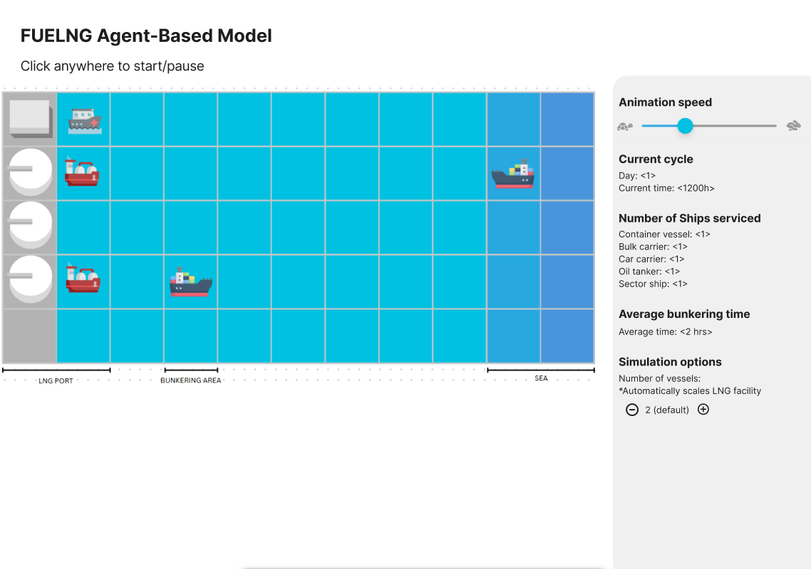
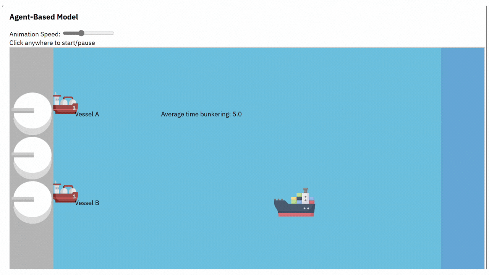
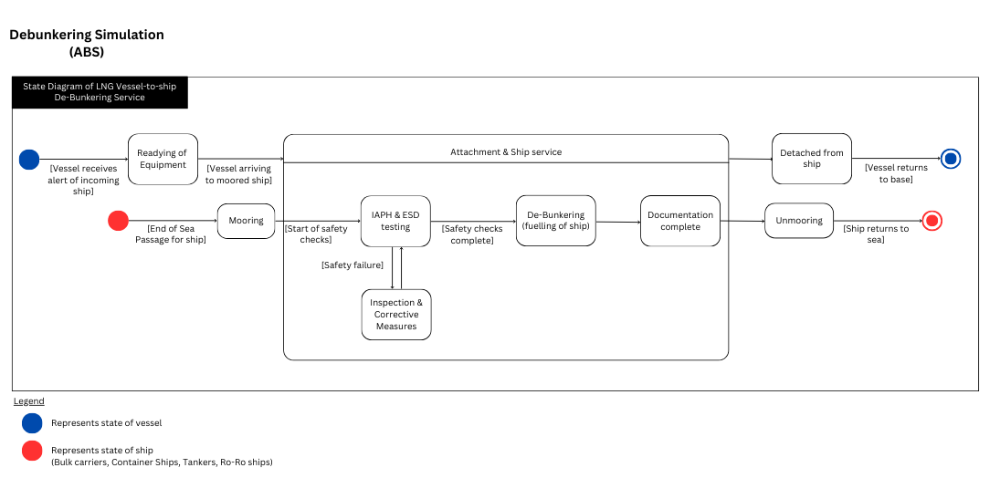

# ABS-simulation

## To-do's
- [X] Add 3/4 more ship types for simulation + Upload image assets for different vessels.
- [X] Create side bar layout for statistics purposes.
- [X] "Current cycle" statistics: 1h = 1s in simulation time.
- [ ] Fix vessels/ships behaviours: have instances when they fail to function --> use the repair vessel and bring them to a repairing dock or something + add delays (1-3 kind of delays).
- [ ] Fix vessels/ships behaviours: randomly pick from a uniform distribution when their bunkering is done based on the range of propobabilities of ship capacity (TEU) and fuel required.
- [ ] Fix vessels/ships behaviours: add vessel capacity and refuel when needed.
- [ ] Fix vessels/ships behaviours: have a waiting queue/list in line.
- [ ] Deploy to cloud (if needed).

Proposed UI simulation workflow: 
<div style="text-align: center;">
    
</div>

## Installation
### Download code
```shell
git clone https://github.com/FUELNG-x-SDS/ABS-simulation.git
cd ABS-simulation
```

### Python Environment Flask Setup
```shell
pip install Flask
python main.py
```

## About
Agent-based Simulation for FUELNG debunkering services.

<div style="text-align: center;">
    
</div>

<div style="text-align: center;">
    
</div>

##  Table of Contents
- Features
- Installation
- Usage
- Simulation Overview
- Key Functions
- Configuration
- Troubleshooting

## Features

- Real-time visualization of LNG bunkering operations

- Two bunkering vessels with different capacities

- Four types of ships with different LNG requirements

- Breakdown and repair mechanics

- Statistics tracking

- Adjustable simulation speed

## Simulation Overview

The simulation consists of:

Bunkering Vessels:

- Bellina (7,000 m³ capacity) - Services car carriers and bulk carriers

- Venosa (16,800 m³ capacity) - Services all ship types

Ships:

- Container vessels (8,000 m³ requirement)

- Car carriers (1,100 m³ requirement)

- Bulk carriers (3,000 m³ requirement)

- Oil tankers (10,000 m³ requirement)

Repair System:

- Vessels can randomly break down

- Dedicated repair vessel responds to breakdowns

- Broken vessels are taken to the repair facility

## Key Functions

Core Functions

- redrawWindow() - Initializes and resets the simulation display

- updateSurface() - Updates all visual elements on the screen

- simStep() - Main simulation loop that advances the simulation by one step

- toggleSimStep() - Starts/pauses the simulation

Agent Management

- addDynamicAgents() - Creates new ships based on arrival probability

- updateShip(shipIndex) - Handles ship movement and state changes

- updateVessel(vesselIndex) - Manages vessel behavior including breakdowns and repairs

- removeDynamicAgents() - Removes ships that have completed bunkering

Utility Functions

- getRandomInt(min, max) - Generates random integers

- getLocationCell(location) - Converts grid coordinates to screen coordinates

- updateCurrentCycleDisplay(time) - Updates the time display

- updateShipCounters() - Updates the ship service counters

## Troubleshooting
Problem: Simulation doesn't start

- Solution: Ensure you're using a modern browser and have allowed scripts to run

Problem: Images not displaying

- Solution: Check that all image files are in the static/images/ directory

Problem: Simulation runs too fast/slow

- Solution: Adjust the speed slider or modify animationDelay in the code

## License

This project is licensed under the MIT License - see the LICENSE file for details.
